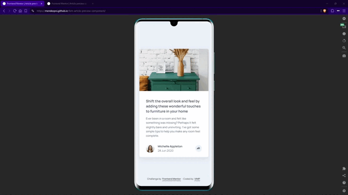

# Frontend Mentor - Article preview component solution

This is a solution to the [Article preview component challenge on Frontend Mentor](https://www.frontendmentor.io/challenges/article-preview-component-dYBN_pYFT). Frontend Mentor challenges help you improve your coding skills by building realistic projects. 

## 📄 Table of contents

- [Overview](#-overview)
  - [The challenge](#-the-challenge)
  - [Screenshots](#-screenshots)
  - [Links](#-links)
- [My process](#️-my-process)
  - [Built with](#-built-with)
  - [What I learned](#-what-i-learned)
- [Author](#-author)
- [Acknowledgments](#-acknowledgments)

## 🧩 Overview

### 🎯 The challenge

Users should be able to:

- View the optimal layout for the component depending on their device's screen size
- See the social media share links when they click the share icon
- Close the share panel by clicking outside or pressing the `Escape` key.
- Experience accessible behavior via `aria-*` attributes and keyboard handling.

### 📸 Screenshots

### 🔗 Links

- [Live site](https://mendezpvi.github.io/fem-article-preview-component/)

- [Frontend Mentor solution](https://www.frontendmentor.io/solutions/article-preview-component-responsive-layout-accessible-interactions-8IWuCGZeXM)

## 🛠️ My process

I built this component following a mobile-first workflow with semantic HTML5, focusing on accessibility and keyboard usability.  
I also leveraged modern CSS features like nesting, logical properties, and clamp() for fluid, responsive design.  
JavaScript is kept minimal and handles interaction and ARIA synchronization only.

### 🧱 Built with

- Semantic HTML5 markup
- Modern CSS features
  - CSS custom properties
  - Grid & Flexbox
  - CSS Nesting
  - Logical properties
  - `clamp()` for fluid typography
- JavaScript (Vanilla) for accessibility and interaction
- Mobile-first workflow

### 💡 What I learned

- **Managing accessible interactive components with `aria-expanded`**  
Properly toggling aria-expanded keeps the UI and assistive technology in sync.  
Combined with hidden, it ensures that the share panel isn’t exposed to screen readers when closed.

- **Handling outside clicks with `stopPropagation()` and `contains()`**  
To close floating panels effectively, prevent event bubbling from the button and detect clicks outside the component using `.contains()`.

- **Using Conventional Commits for clean commit history**  
Clear, consistent commits like `feat(core):` or `docs(preview):` make the project’s progression understandable and maintainable.

- **Applying CSS logical properties and clamp() for flexible responsive design**  
Logical properties (`inline-size`, `block-size`) improve adaptability across writing modes, while `clamp()` enables fluid yet constrained scaling for typography and spacing.

## 🧑‍💻 Author

- Frontend Mentor - [@mendezpvi](https://www.frontendmentor.io/profile/mendezpvi)

## 🙌 Acknowledgments

- Challenge and design by Frontend Mentor — thanks for the clear brief and assets.
- Assisted and reviewed with the help of **ChatGPT** for structure and best practices.
